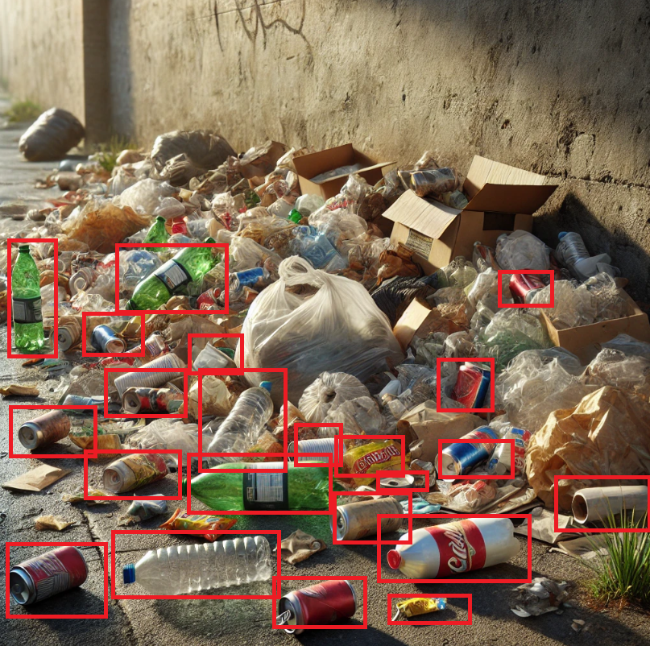
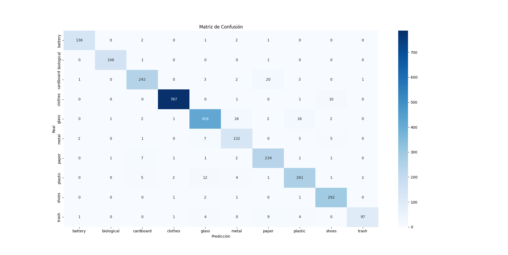
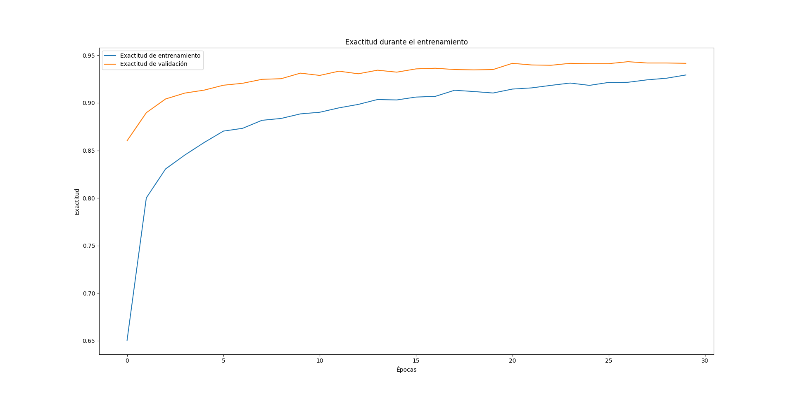
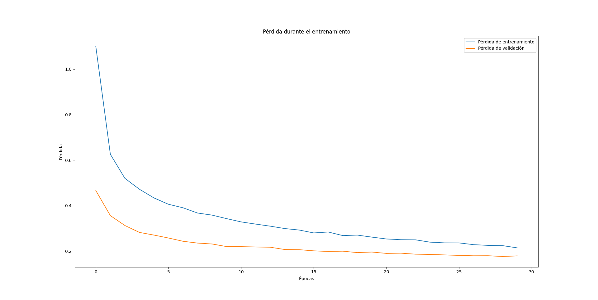
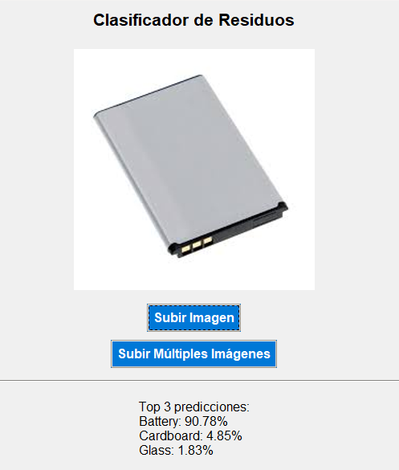
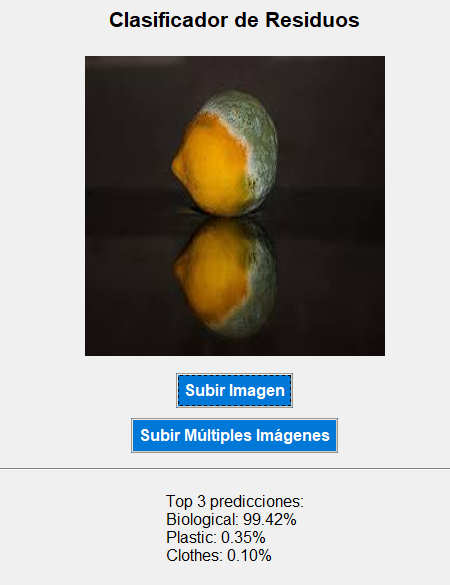
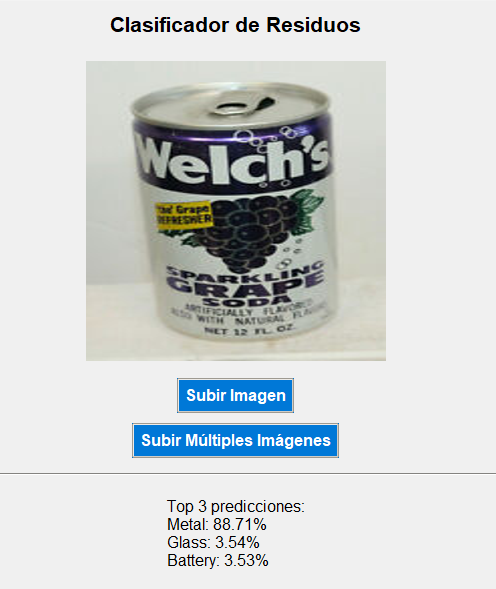

# Proyecto de Clasificación de Basura con Redes Neuronales Convolucionales



## Índice

1. [Introducción](#introducción)
2. [Requisitos](#requisitos)
3. [Instalación](#instalación)
4. [Descripción del Código](#descripción-del-código)
    - [Archivos Principales](#archivos-principales)
5. [Dataset](#dataset)
6. [Entrenamiento](#entrenamiento)
    - [Proceso de Entrenamiento](#proceso-de-entrenamiento)
    - [Parámetros de Entrenamiento](#parámetros-de-entrenamiento)
7. [Evaluación y Resultados](#evaluación-y-resultados)
8. [Imágenes y Visualización](#imágenes-y-visualización)
9. [Licencia](#licencia)
10. [Evolución del entrenamiento](#evolución-del-entrenamiento)

## Introducción

Este proyecto tiene como objetivo desarrollar una **red neuronal convolucional** capaz de clasificar imágenes de basura en diez categorías diferentes. La clasificación correcta de residuos es un paso crucial hacia una gestión de desechos más eficiente y sostenible, facilitando procesos de reciclaje.

Las categorías de clasificación son:

- **Battery** 
- **Biological**
- **Cardboard**
- **Clothes** 
- **Glass** 
- **Metal** 
- **Paper** 
- **Plastic** 
- **Shoes** 
- **Trash**

Se utiliza una CNN debido a su eficacia comprobada en tareas de visión por computadora y reconocimiento de imágenes.

## Requisitos

Para ejecutar este proyecto, se necesitan las siguientes herramientas y bibliotecas:

- **Python 3.7 o superior**
- **TensorFlow**
- **NumPy**
- **Pandas**
- **Matplotlib**
- **Seaborn**
- **OpenCV**
- **scikit-learn**
- **Pillow**
- **tkinter**
- **CUDA Toolkit** (opcional)

### Versiones Específicas(se ha ejecutado en windows 11)

- **TensorFlow**:2.18.0
- **NumPy**: 1.26.4
- **Pandas**: 2.2.2
- **Matplotlib**: 3.9.2
- **Seaborn**: 0.13.2
- **OpenCV**:  4.10.0
- **scikit-learn**:  1.5.2
- **Pillow**: 10.4.0 

## Instalación

Sigue estos pasos para configurar y ejecutar el proyecto:

## Instalación

Sigue los siguientes pasos para configurar y ejecutar el proyecto en tu entorno local:

1. **Clona el repositorio**:

   ```bash
   git clone https://github.com/moises60/clasificar_basura_con_CNN.git
   ```

2. **Accede al directorio del proyecto**:

   ```bash
   cd clasificar_basura_con_CNN
   ```


6. **Descarga del Dataset**:

   - Descarga el **Garbage Dataset** desde [Kaggle](https://www.kaggle.com/datasets/sumn2u/garbage-classification-v2).
   - Crea una carpeta llamada `Dataset` en el directorio del proyecto y coloca el contenido del dataset allí.
   - Asegúrate de que las subcarpetas estén organizadas correctamente:

     ```
     Dataset/
     ├── battery/
     ├── biological/
     ├── cardboard/
     ├── clothes/
     ├── glass/
     ├── metal/
     ├── paper/
     ├── plastic/
     ├── shoes/
     └── trash/
     ```

7. **Preparación del Dataset**:

   - Ejecuta el script `preparar_dataset.py` para organizar el dataset en conjuntos de entrenamiento, validación y prueba.

     ```bash
     python preparar_dataset.py
     ```

8. **Entrenamiento del Modelo**:

   - Ejecuta el script `CNN_garbage.py` para entrenar el modelo.

     ```bash
     python CNN_garbage.py
     ```

9. **Interfaz Gráfica**:

   - Una vez entrenado el modelo, puedes probar la clasificación utilizando la interfaz gráfica.

     ```bash
     python clasificador_basura.py
     ```
## Descripción del Código

El proyecto consta de los siguientes archivos principales:

- **`preparar_dataset.py`**: Organiza el dataset original en carpetas de entrenamiento, validación y prueba, distribuyendo las imágenes en proporciones del 70%, 15% y 15%, respectivamente.

- **`CNN_garbage.py`**: Contiene el código para la construcción, entrenamiento y evaluación del modelo CNN. Utiliza Transfer Learning con MobileNetV2 y aplica técnicas de Data Augmentation.

- **`clasificador_basura.py`**: Proporciona una interfaz gráfica de usuario creada con `tkinter`, que permite cargar imágenes y obtener predicciones del modelo entrenado.

## El directorio debe quedar estructurado de la siguiente forma después de ejecutar los códigos anteriores.
     ```
    assets
    Dataset/ 
     ├── battery/
     ├── biological/
     ├── cardboard/
     ├── clothes/
     ├── glass/
     ├── metal/
     ├── paper/
     ├── plastic/
     ├── shoes/
     └── trash/
    garbage_dataset/
     ├── test/
     ├── train/
     ├── val/
    clasificador_basura.py
    CNN_garbage.py
    license.txt
    mejor_modelo_garbage.keras
    modelo_garbage_final.keras
    preparar_dataset.py
    README.md
     ```
## Dataset

El dataset utilizado es el **Garbage Classification Dataset**, disponible en [Kaggle](https://www.kaggle.com/datasets/sumn2u/garbage-classification-v2).

- **Licencia**: MIT License

## Entrenamiento

### Proceso de Entrenamiento

El modelo fue entrenado utilizando Transfer Learning con **MobileNetV2** como modelo base. Las capas del modelo base fueron congeladas inicialmente, y se añadieron capas densas para ajustar al problema específico.

Se aplicaron técnicas de **Data Augmentation** para mejorar la capacidad de generalización del modelo:

- Rotaciones aleatorias
- Desplazamientos horizontales y verticales
- Zoom aleatorio
- Volteo horizontal
- Variaciones de brillo

### Parámetros de Entrenamiento

- **Épocas**: 30
- **Tamaño de lote**: 32
- **Optimización**: Adam optimizer
- **Tasa de aprendizaje**: 1e-4
- **Funciones de pérdida**: Categorical Crossentropy
- **Métricas**: Accuracy

### Resultados del Entrenamiento

El modelo mostró una mejora constante durante el entrenamiento:

- **Exactitud de entrenamiento**: Desde 51.13% en la época 1 hasta 92.86% en la época 30.
- **Exactitud de validación**: Desde 86.01% en la época 1 hasta 94.16% en la época 30.

## Evaluación y Resultados

El modelo fue evaluado en el conjunto de prueba, obteniendo:

- **Pérdida en prueba**: 0.1876
- **Exactitud en prueba**: 94.07%

### Reporte de Clasificación

| Clase        | Precisión (%) | Recall (%) | F1-Score (%) | Soporte |
|--------------|---------------|------------|--------------|---------|
| **Battery**      | 97            | 96         | 96           | 142     |
| **Biological**   | 99            | 99         | 99           | 148     |
| **Cardboard**    | 93            | 89         | 91           | 272     |
| **Clothes**      | 99            | 98         | 99           | 799     |
| **Glass**        | 93            | 91         | 92           | 456     |
| **Metal**        | 82            | 88         | 85           | 150     |
| **Paper**        | 87            | 94         | 91           | 248     |
| **Plastic**      | 90            | 91         | 90           | 288     |
| **Shoes**        | 94            | 98         | 96           | 297     |
| **Trash**        | 97            | 84         | 90           | 116     |
| **Promedio Macro** | **93**        | **93**     | **93**        |         |
| **Promedio Ponderado** | **94**        | **94**     | **94**        | **2916** |

### Matriz de Confusión




## Imágenes y Visualización


- **Gráfica de Precisión y Pérdida**

  

- **Matriz de Confusión**: Permite identificar las clases donde el modelo tiene dificultades.

  

### Interfaz Gráfica

### Ejemplos de Clasificación

A continuación, se muestran ejemplos de imágenes clasificadas por el modelo:

#### Ejemplo 1: 




#### Ejemplo 2: 




#### Ejemplo 3: 



## Licencia
    MIT License

## Evolución del entrenamiento

Epoch 1/30
425/425 ━━━━━━━━━━━━━━━━━━━━ 126s 291ms/step - accuracy: 0.5113 - loss: 1.5393 - val_accuracy: 0.8601 - val_loss: 0.4659

Epoch 2/30
425/425 ━━━━━━━━━━━━━━━━━━━━ 108s 254ms/step - accuracy: 0.7842 - loss: 0.6774 - val_accuracy: 0.8897 - val_loss: 0.3557

Epoch 3/30
425/425 ━━━━━━━━━━━━━━━━━━━━ 108s 253ms/step - accuracy: 0.8214 - loss: 0.5415 - val_accuracy: 0.9041 - val_loss: 0.3122

Epoch 4/30
425/425 ━━━━━━━━━━━━━━━━━━━━ 108s 253ms/step - accuracy: 0.8433 - loss: 0.4862 - val_accuracy: 0.9103 - val_loss: 0.2818

Epoch 5/30
425/425 ━━━━━━━━━━━━━━━━━━━━ 108s 254ms/step - accuracy: 0.8570 - loss: 0.4410 - val_accuracy: 0.9134 - val_loss: 0.2700

Epoch 6/30
425/425 ━━━━━━━━━━━━━━━━━━━━ 108s 254ms/step - accuracy: 0.8703 - loss: 0.4095 - val_accuracy: 0.9186 - val_loss: 0.2572

Epoch 7/30
425/425 ━━━━━━━━━━━━━━━━━━━━ 108s 253ms/step - accuracy: 0.8688 - loss: 0.4005 - val_accuracy: 0.9206 - val_loss: 0.2428

Epoch 8/30
425/425 ━━━━━━━━━━━━━━━━━━━━ 108s 254ms/step - accuracy: 0.8790 - loss: 0.3776 - val_accuracy: 0.9247 - val_loss: 0.2349

Epoch 9/30
425/425 ━━━━━━━━━━━━━━━━━━━━ 110s 259ms/step - accuracy: 0.8848 - loss: 0.3484 - val_accuracy: 0.9254 - val_loss: 0.2309

Epoch 10/30
425/425 ━━━━━━━━━━━━━━━━━━━━ 109s 257ms/step - accuracy: 0.8907 - loss: 0.3440 - val_accuracy: 0.9313 - val_loss: 0.2195

Epoch 11/30
425/425 ━━━━━━━━━━━━━━━━━━━━ 110s 258ms/step - accuracy: 0.8894 - loss: 0.3340 - val_accuracy: 0.9289 - val_loss: 0.2192

Epoch 12/30
425/425 ━━━━━━━━━━━━━━━━━━━━ 113s 266ms/step - accuracy: 0.8915 - loss: 0.3308 - val_accuracy: 0.9333 - val_loss: 0.2177

Epoch 13/30
425/425 ━━━━━━━━━━━━━━━━━━━━ 165s 389ms/step - accuracy: 0.8977 - loss: 0.3086 - val_accuracy: 0.9306 - val_loss: 0.2166

Epoch 14/30
425/425 ━━━━━━━━━━━━━━━━━━━━ 109s 256ms/step - accuracy: 0.9016 - loss: 0.3018 - val_accuracy: 0.9344 - val_loss: 0.2065

Epoch 15/30
425/425 ━━━━━━━━━━━━━━━━━━━━ 108s 254ms/step - accuracy: 0.9016 - loss: 0.2962 - val_accuracy: 0.9323 - val_loss: 0.2058

Epoch 16/30
425/425 ━━━━━━━━━━━━━━━━━━━━ 109s 256ms/step - accuracy: 0.9050 - loss: 0.2818 - val_accuracy: 0.9357 - val_loss: 0.2007

Epoch 17/30
425/425 ━━━━━━━━━━━━━━━━━━━━ 108s 254ms/step - accuracy: 0.9102 - loss: 0.2772 - val_accuracy: 0.9364 - val_loss: 0.1979

Epoch 18/30
425/425 ━━━━━━━━━━━━━━━━━━━━ 107s 253ms/step - accuracy: 0.9140 - loss: 0.2676 - val_accuracy: 0.9351 - val_loss: 0.1992

Epoch 19/30
425/425 ━━━━━━━━━━━━━━━━━━━━ 108s 254ms/step - accuracy: 0.9076 - loss: 0.2847 - val_accuracy: 0.9347 - val_loss: 0.1930

Epoch 20/30
425/425 ━━━━━━━━━━━━━━━━━━━━ 134s 315ms/step - accuracy: 0.9110 - loss: 0.2592 - val_accuracy: 0.9351 - val_loss: 0.1954

Epoch 21/30
425/425 ━━━━━━━━━━━━━━━━━━━━ 108s 253ms/step - accuracy: 0.9121 - loss: 0.2564 - val_accuracy: 0.9416 - val_loss: 0.1894

Epoch 22/30
425/425 ━━━━━━━━━━━━━━━━━━━━ 108s 253ms/step - accuracy: 0.9164 - loss: 0.2472 - val_accuracy: 0.9399 - val_loss: 0.1904

Epoch 23/30
425/425 ━━━━━━━━━━━━━━━━━━━━ 111s 261ms/step - accuracy: 0.9204 - loss: 0.2482 - val_accuracy: 0.9395 - val_loss: 0.1860

Epoch 24/30
425/425 ━━━━━━━━━━━━━━━━━━━━ 111s 262ms/step - accuracy: 0.9201 - loss: 0.2363 - val_accuracy: 0.9416 - val_loss: 0.1849

Epoch 25/30
425/425 ━━━━━━━━━━━━━━━━━━━━ 111s 262ms/step - accuracy: 0.9193 - loss: 0.2354 - val_accuracy: 0.9412 - val_loss: 0.1827

Epoch 26/30
425/425 ━━━━━━━━━━━━━━━━━━━━ 111s 261ms/step - accuracy: 0.9217 - loss: 0.2386 - val_accuracy: 0.9412 - val_loss: 0.1807

Epoch 27/30
425/425 ━━━━━━━━━━━━━━━━━━━━ 111s 262ms/step - accuracy: 0.9231 - loss: 0.2219 - val_accuracy: 0.9433 - val_loss: 0.1790

Epoch 28/30
425/425 ━━━━━━━━━━━━━━━━━━━━ 110s 259ms/step - accuracy: 0.9245 - loss: 0.2282 - val_accuracy: 0.9419 - val_loss: 0.1792

Epoch 29/30
425/425 ━━━━━━━━━━━━━━━━━━━━ 111s 260ms/step - accuracy: 0.9245 - loss: 0.2285 - val_accuracy: 0.9419 - val_loss: 0.1758

Epoch 30/30
425/425 ━━━━━━━━━━━━━━━━━━━━ 111s 261ms/step - accuracy: 0.9286 - loss: 0.2117 - val_accuracy: 0.9416 - val_loss: 0.1785

92/92 ━━━━━━━━━━━━━━━━━━━━ 13s 143ms/step - accuracy: 0.9510 - loss: 0.1550

Pérdida en prueba: 0.1876240372657776

Exactitud en prueba: 0.9406721591949463


